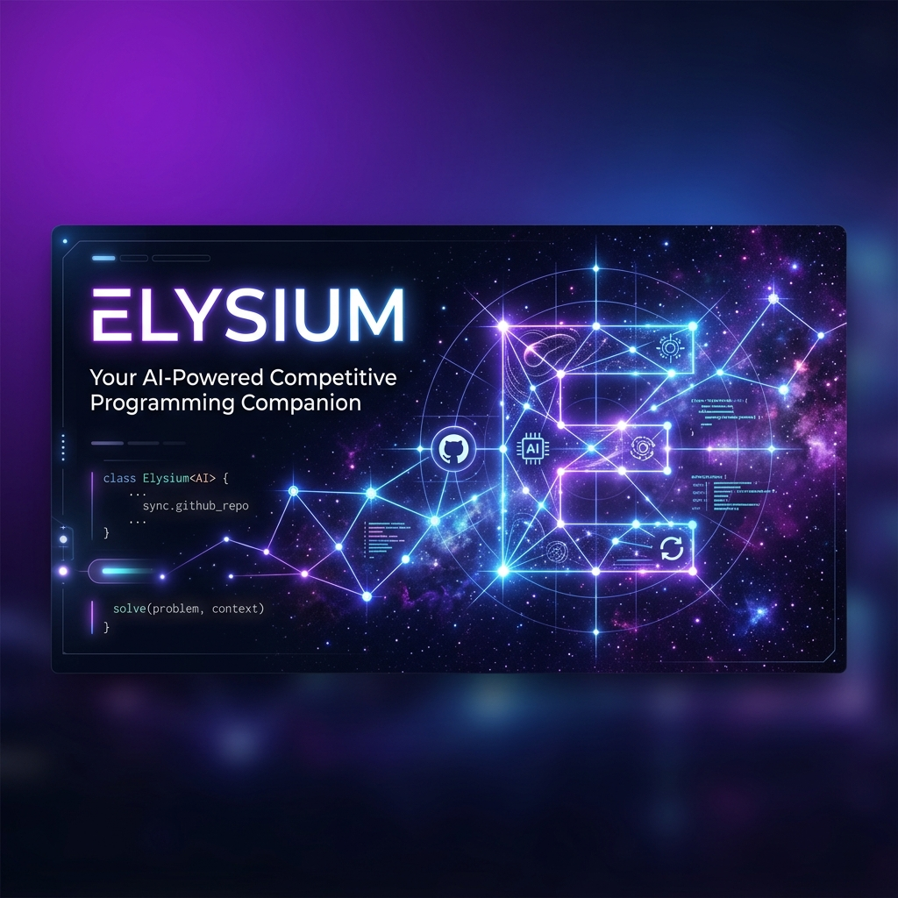
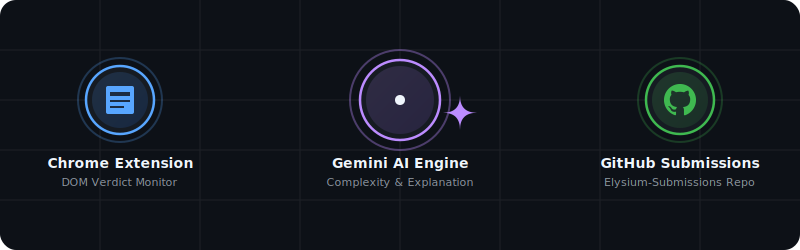

# ELYSIUM 🌌

<p align="center">
  <!-- 
   -->
   <video controls autoplay>
     <source src="assets/elysiumintro.mp4" type="video/mp4">
   </video>
</p>

<p align="center">
  <strong>Your AI-Powered Competitive Programming Companion</strong>
</p>

<p align="center">
  
  
  
</p>

---

## 💫 Core Concept & Workflow

**ELYSIUM** makes tracking your competitive programming journey completely seamless. The moment you submit a solution on GeeksforGeeks and it gets accepted, the Elysium Chrome Extension captures the solution, prompts Google's Gemini AI to analyze the logic and complexity, formats it into premium markdown, and uploads the code along with the analysis directly to your private or public GitHub profile.

### Interactive Live Workflow
<p align="center">
  
</p>

---

## ✨ Features

- 🖥️ **Chrome Extension Integration**: Built on Manifest V3, using a background `MutationObserver` to monitor DOM changes on problem pages and catch the exact moment your solution gets accepted.
- 🧠 **Google Gemini API Power**: Integrates the state-of-the-art Generative AI model to clean source code formatting, estimate time & space complexities ($O(N)$, $O(1)$, etc.), and write clear logic breakdowns.
- 📁 **Structured GitHub Repo Syncing**: Automatically creates and syncs solutions to a repository named `Elysium-Submissions` under folders organized by problem title (e.g. `Indexes_of_Subarray_Sum/`).
- 📂 **Local Archive Backups**: Saves local `.txt` copies of all your correct code submissions in a dedicated `server/submissions/` folder.
- 🔐 **Secure OAuth Flow**: Includes a native, built-in GitHub OAuth authentication route (`/auth/github`) to securely connect and save tokens to `server/token.json`.

---

## 📂 Repository Breakdown

```txt
ELYSIUM/
│
├── frontend/                   # Vite + React frontend
│   ├── index.html              # Vite entry page
│   ├── src/                    # React app, routes, and styles
│   ├── public/assets/          # Copied project media for the UI
│   └── package.json            # Frontend scripts and dependencies
│
├── elysium-extension/         # Chrome Extension (Manifest V3)
│   ├── manifest.json          # Extension config & permissions
│   └── content.js             # Observers click actions, extracts code, posts to server
│
├── server/                    # Backend Server (Node.js & Express)
│   ├── routes/
│   │   ├── auth.js            # GitHub OAuth setup & callback
│   │   └── upload.js          # Connected account status checking
│   ├── utils/
│   │   └── github.js          # File & repo interaction with GitHub APIs
│   ├── gemini.js              # Gemini SDK client with custom parsing safety
│   ├── server.js              # Main Express server entrypoint
│   ├── .env                   # Local keys and secrets (git-ignored)
│   └── token.json             # Cached GitHub login token (git-ignored)
│
├── assets/                    # Graphic assets & animated flow diagrams
│   ├── elysium_banner.png
│   └── elysium_flow.svg
│
└── README.md                  # Main Documentation
```

---

## 🚀 Setting Up Elysium

### 1. Prerequisites
Make sure you have [Node.js](https://nodejs.org/) (version 18+) installed.

### 2. Configure the Backend Server
1. Clone this repository and navigate to the `server/` directory:
   ```bash
   cd server
   ```
2. Install the necessary Node packages:
   ```bash
   npm install
   ```
3. Create a `.env` file inside `server/` with the following variables:
   ```env
   GEMINI_API_KEY=your_gemini_api_key
   GITHUB_CLIENT_ID=your_github_client_id
   GITHUB_CLIENT_SECRET=your_github_client_secret
   ```
   > [!NOTE]
   > You can get your **Gemini API Key** from [Google AI Studio](https://aistudio.google.com/).
   > The **GitHub Client ID/Secret** can be generated by creating a New OAuth Application in your GitHub Developer settings.

4. Start the server using Nodemon (auto-reloading dev mode):
   ```bash
   npm run dev
   ```

### 3. Run the Vite Frontend
1. Open a new terminal and navigate to the `frontend/` directory:
   ```bash
   cd frontend
   ```
2. Install the frontend dependencies:
   ```bash
   npm install
   ```
3. Start the Vite development server:
   ```bash
   npm run dev
   ```
4. For a production-style build that the Express server can serve from `frontend/dist/`, run:
   ```bash
   npm run build
   ```

### 4. Install the Chrome Extension
1. Open Google Chrome and go to `chrome://extensions/`.
2. Toggle on **Developer mode** in the top-right corner.
3. Click on the **Load unpacked** button in the top-left.
4. Select the `elysium-extension` folder in your ELYSIUM project directory.

### 5. Authenticate with GitHub
1. Open your browser and navigate to:
   ```txt
   http://localhost:3000/auth/github
   ```
2. Authorize the application on GitHub. Once connected, your authorization credentials will be cached in `server/token.json` safely.

---

## 🛠️ How it Works under the Hood

### 1. Detection & Extraction (`content.js`)
When you click the **Submit** button on a GeeksforGeeks page, a click listener triggers a `MutationObserver`. It scans the DOM until it detects the message `"Problem Solved Successfully"`.
Once found, it extracts:
- Code contents from Monaco or Ace editors.
- Problem title and URL.
- Metadata (Difficulty, Accuracy, Average Solve Time).
- Prepares a payload and POSTs it to `http://localhost:3000/submission`.

### 2. AI Code Analysis (`gemini.js`)
The backend passes the payload to Gemini using a strict competitive programming tutor prompt. The AI parses the submission and responds with structured JSON containing:
- `cleaned_code`: Source code with neat whitespace and indentation.
- `metadata`: Sub-object containing complexities and topics.
- `explanation_markdown`: A highly readable logic guide.

### 3. File Archiving & Pushing (`github.js`)
The server validates the local token:
- If a repo named `Elysium-Submissions` does not exist on your profile, it creates it programmatically.
- It pushes the source code to a dedicated subfolder (`Title/Title.ext`).
- It generates a detailed `README.md` for the problem containing the AI complexity breakdown and logic explanation, and commits it alongside the code.
- A local `.txt` backup of your code is also saved inside the `server/submissions/` folder.
